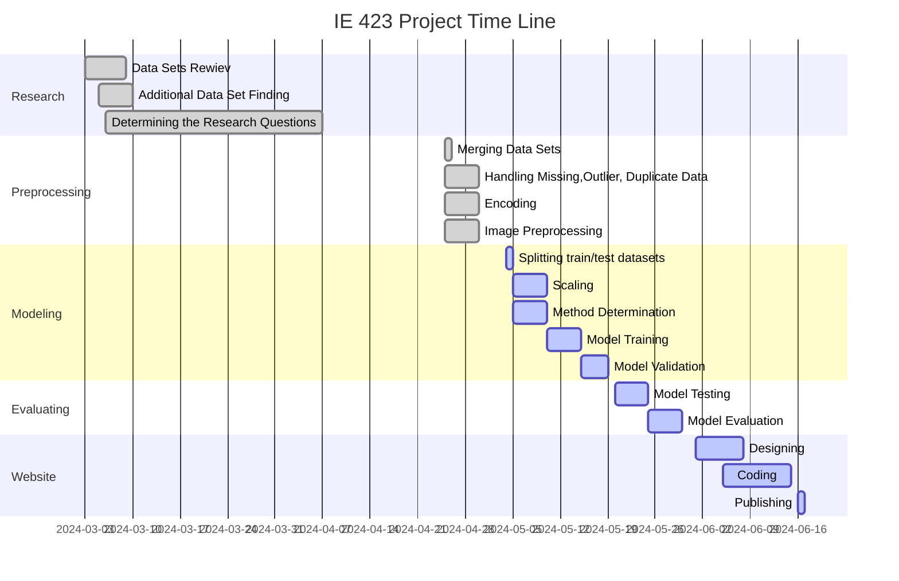

## *Director Prediction Based on the Film's Characteristics*

## *Principal Goals of the Project* 
The film industry is a complex environment where various factors influence the decisions behind movie production. One crucial aspect is the director, whose vision and style can impact the outcome of a film.The main purpose of the project is to predict the director by taking into account various features of the films. When generating predictions, factors including the movie's genre, cast, release year, length, type, rating, and description of the film are considered. In addition to these characteristics, Bechdel test scores and movie posters are also utilized to predict the director. These features have been considered to add new perspectives to predicting the film director.By incorporating a diverse range of features, the aim is to build a comprehensive model that can accurately predict the director of a given film.

## *Resarch Questions* 
- How accurately can we predict the director of a movie based on features such as cast, duration, genre, Bechdel score, IMDb score?
- What are the most significant factors influencing the choice of director for a movie?
- How does the performance of different machine learning algorithms compare in predicting movie directors based on film characteristics?

## *Utilizing of the datasets*
First of all, two data sets contining Amazon Prime and Netflix movies and TV shows are used. These data sets provide details on the movie's titles, directors, casts, countries, and genres.

In addition, the data set containing Bechdel tests scores of movies is used. 

A separate data set is used to obtain the necessary information about the posters of the movies.

## *Preprocessing Steps*

### Detalied Explanation of Preprocessing Parts
In this project, libraries such as Pandas, NumPy, Seaborn, Matplotlib.pyplot, sklearn.datasets, sklearn.metrics, sklearn.model_selection, sklearn.preprocessing.OneHotEncoder, and sklearn.preprocessing.StandardScaler were used.
Initially, URLs containing CSV files were fetched, read, and converted into dataframes. Subsequently, dataframe names were changed to more meaningful ones.
A for loop was then created to split the "Title" column and extract the year enclosed in parentheses. Additionally, "Title" entries, which start with a capital letter, were corrected to start with a lowercase "title".The dataframes netflix_df, prime_df, bechdel_df, and movieposter_df were merged. Null and duplicate data were regularly checked for and removed if any existed. The Netflix and Amazon datasets were merged based on the 'title' column, combining the datasets into one. Following this, three DataFrames were merged: merged_df and bechdel_df were merged based on the 'title' column into merged_bnp_df, and then merged_bnp_df and movieposter_df were merged based on the 'title' column into allmerged_df. Subsequently, the presence of duplicates in the merged data frame was checked. unwanted columns were removed from the dataset, such as 'show_id', 'date_added', 'imdbid', ', 'description',  'Imdb Link''year_y'.Then, the remaining columns were sorted in the desired order. Null data was initially examined, with 17 null values identified in the 'cast' column, 317 in the 'country' column, and 92 in the 'director' column. Following this assessment, subsequent operations were performed on the dataset. 

In the next step, the first three actors' names from each row in the 'cast' column were extracted and labeled as cast1, cast2, and cast3, while the original 'cast' column was removed. Any null values identified in the preceding steps were then removed.The code in one part splits each entry in the 'Genre' column using the '|' character and selects the first category. Similarly, it separates each entry in the 'country' column using the ',' character and picks the first country mentioned.Another part ensures that only the initial numerical value is retained within each entry of the 'duration' column. There's a section intended to identify duplicate data within the dataset, revealing 18 instances of duplicate data upon examination.And then, duplicate rows are removed from the 'cleaned_df' DataFrame. 

The following step in preprocessing involves checking for outliers.The 'Duration' column was examined for outliers, and the data points with a value equal to 1, namely [136, 169, 221, 229, 246, 247], were removed from the dataset. The function f.get_ydata was used. No outlier data was found for the Bechdel test, except for the 'Duration' column. As data dropping operations are performed, inconsistencies arise with the indices. Therefore, to prevent this, the index count is reset. 

Following this, for each movie in the 'no_outlier_df' DataFrame, it calculates the normalized average of RGB components. This represents the percentage of each color in the image. These percentages are then added to new columns named 'Red', 'Green', and 'Blue'. If accessing an image fails, an error counter is incremented. Finally, the updated DataFrame, containing the RGB components of each image, is printed. Dropping operations were later carried out for the 55 URLs that were successfully accessed. The poster column was removed later because the desired red, green and blue color measurements were obtained from the posters. 

The next stage after removing the poster column is the encoding stage. Encoding has been performed using OneHotEncoder. By selecting the 'Cast1', 'Cast2', and 'Cast3' columns, encoding has been done based on the 'cast' column. Before the encoding process began, the shape of the DataFrame was [592 rows × 16 columns]. After the initial encoding step, it reached [646 rows × 1463 columns].Following the encoding process based on the 'cast' column, encoding was then performed for the 'type', 'country', 'rating_merged', and 'Genre' columns. Subsequently, null values were dropped, resulting in the dataset becoming 538 rows × 1532 columns. After the encoding steps, the director column was checked. It was determined that there were 440 unique director entries. Next, the frequency of each director entry was examined. In addition to the previous encoding steps, a LabelEncoder process was also applied to the 'director' column. Finally, the columns were arranged in the desired order and we have a total of [538 rows x 1532 columns] data available.

## *Next Steps*
- Choosing suitable machine learning algorithms for the predicting.
- Splitting the preprocessed dataset into train and test sets.
- Model training, validation and testing.
- Model evuluation
  

### *Sources of Data Sets*
[Amazon Prime Movies and TV Shows](https://www.kaggle.com/datasets/shivamb/amazon-prime-movies-and-tv-shows)

[Netflix Movies and TV Shows](https://www.kaggle.com/datasets/shivamb/netflix-shows)

[Movie Bechdel Test Scores](https://www.kaggle.com/datasets/alisonyao/movie-bechdel-test-scores?select=Bechdel_detailed.csv)

[Movie Genre from its Poster](https://www.kaggle.com/datasets/neha1703/movie-genre-from-its-poster)

#### *Contributors*
Berk Ayata 120203013

Burcu Ağu 116203010

Canan Selek 120203050

Özge Sıla Çakmak 120203055

